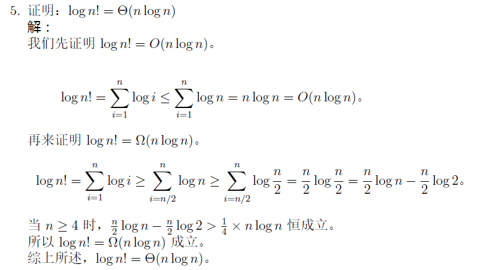
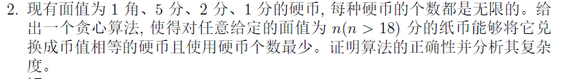

# algorithm
哈工大2023秋算法设计与分析 zkq

#关于老师
张开旗老师，个人认为讲的不错，有几次小测，没有点过名；对于一名大三生来说如果课前不做预习很多算法第一次听还是十分懵逼的，分治还行，动态规划有点懵，贪心和树搜索和图也都还能接受，平摊分析那个势能方法有点蒙蔽，幸亏考试没有作为重点，上课可以不听qwq，毕竟大家都会考试突击hhh

#关于作业
首先是老师布置的作业题，都是从课后习题中摘出来的比较简单的题，可以作为第一次看ppt阶段的锻炼一下，有没有看懂ppt讲的是啥的练习；然后是大作业论文阅读，要善用ai帮忙，点到为止hhh；最后就是那个课后习题，都过一遍最好，一是里面的题都不错，二是很有可能出原题；可以没有平摊的练习题qwq

#3.关于考试
1.5号考完，然后坐火车回家，今天已经6号了，我尽量回忆一下

##判断
忘记了qwq

##简答
1.证明题：（作业里的原题）

2.考master定理求解时间复杂度，很简单
3.考迭代法求解时间复杂度
4.阐述A*算法的原理

##算法设计与分析题
1.最大流问题，规定你用push-relable算法求解最大流，写出步骤
2.平摊问题，描述如下：有一个动态数组，有插入操作，和删除操作，插入就是正常添加一个元素，删除操作是删除数组中最大的n/2个数，让你描述操作并平摊分析n个任意操作总的时间复杂度
3.贪心问题：（作业原题，而且更简单，没有2分硬币这个选择）

4.分治问题：
求解一个数组的最大子数组，使其和最大，注意子数组必须连续即可，无难度
5.动态规划：（p2758洛谷原题，有一说一，考场上那20min想把这道题做好还有点难度，如果之前没做过类似的）

设 $A$ 和 $B$ 是两个字符串。我们要用最少的字符操作次数，将字符串 $A$ 转换为字符串 $B$。这里所说的字符操作共有三种：

1. 删除一个字符；
2. 插入一个字符；
3. 将一个字符改为另一个字符。

写在最后：个人感觉判断题还是有两个不太好判断的，也可能是我细节把握不太到位，大题平摊分析也卡了一会，动态规划卡了一会，其余题都很基本原题，要是只想60，那可不要太容易qwq

算法！为了复习你，我都踏马没有出去跨年，在寝室听到炮声想起才知道原来已经2024年了，哎
学弟学妹加油，有信安的学弟学妹想要了解其他考试课的也可以联系我，放一个企鹅号：2309437043
